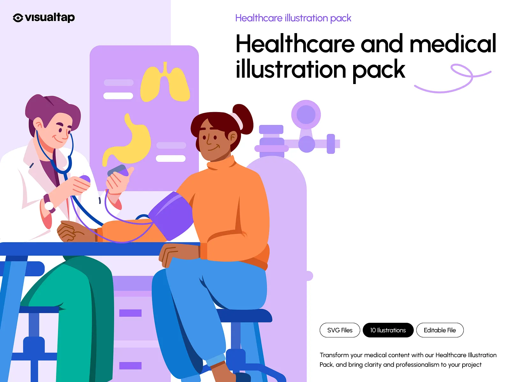

markdown
<!-- Project Banner Image -->
<p align="center">
  
</p>

# Clinic Reservation System 🏥📅

<p align="center">
  <strong>An Online Clinic Reservation & Payment System</strong><br>
  <em>Effortless booking, seamless payments, and comprehensive clinic management.</em>
</p>

---

## 🚀 Technologies Used


---

## 📌 About The Project

Clinic Reservation System is a **freelance project** designed to provide customers a fully featured platform to book appointments online, pay securely, and manage clinic services efficiently.  
It offers:  
- Online booking with real-time availability  
- Secure payment integration  
- Multi-app architecture including core, lazer_area, payment, and reserve  
- Swagger API documentation for ease of integration

---

## 🎯 Features

- User-friendly online reservation interface  
- Payment gateway integration  
- Admin panel with user management  
- Multi-app modular Django backend  
- CORS handling & JWT Authentication  
- Dockerized for easy deployment  

---

## ⚠️ Challenges

- Managing multi-app migrations & dependencies  
- Dockerizing Django with PostgreSQL external database  
- Handling environment configuration interactively  
- Ensuring secure JWT token management  
- Providing clear API documentation with Swagger

---

## 🛠️ How to Run This Project

You can run this project in **two ways**:

---

### Method 1: Using Docker Image (Recommended)

1. Make sure you have **PostgreSQL running** on your machine or a remote server.  
2. Create a database and user matching the environment variables (e.g. `DB_NAME`, `DB_USER`, `DB_PASSWORD`).  
3. Pull the Docker image from Docker Hub:  
   ```bash
   docker pull yourdockerhubusername/clinic_reservation_system:latest


4. Run the container (replace environment variables accordingly):

   ```bash
   docker run -p 8000:8000 --rm -it clinic_reservation_system
   ```
5. When prompted, enter the environment configuration values (or accept defaults).
6. The system will apply migrations, create a superuser, collect static files, and start the Django server automatically.

---

### Method 2: Manual Setup (Development)

1. Clone the repository:

   ```bash
   git clone https://github.com/yourusername/clinic_reservation_system.git
   cd clinic_reservation_system
   ```
2. Install dependencies:

   ```bash
   pip install -r requirements.txt
   ```
3. Run environment setup script:

   ```bash
   python init_env.py
   ```

   * Provide the requested environment variables (or accept defaults).
4. Apply migrations step-by-step for all apps:

   ```bash
   python manage.py makemigrations
   python manage.py makemigrations core lazer_area payment reserve
   python manage.py migrate
   ```
5. Create a superuser (you will be prompted to set username and password):

   ```bash
   python manage.py createsuperuser
   ```
6. Collect static files:

   ```bash
   python manage.py collectstatic --noinput
   ```
7. Run the development server:

   ```bash
   python manage.py runserver 0.0.0.0:8000
   ```

---

## 📄 License

This project is licensed under the MIT License. See the [LICENSE](LICENSE) file for details.

---

## 🙌 Thank You!

Thanks for checking out this project! If you have any questions, feel free to open issues or contact me directly.
This is a freelance project made with ❤️ and passion.

---

<p align="center">
  
</p>
